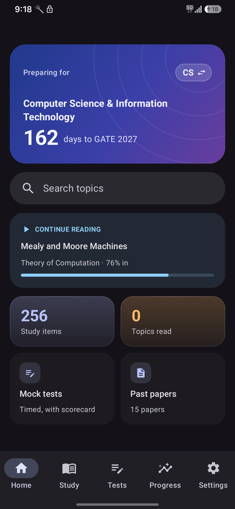
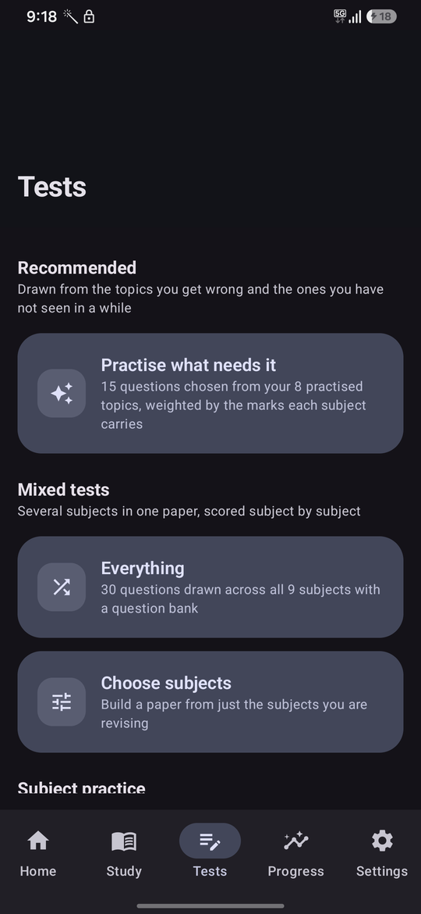
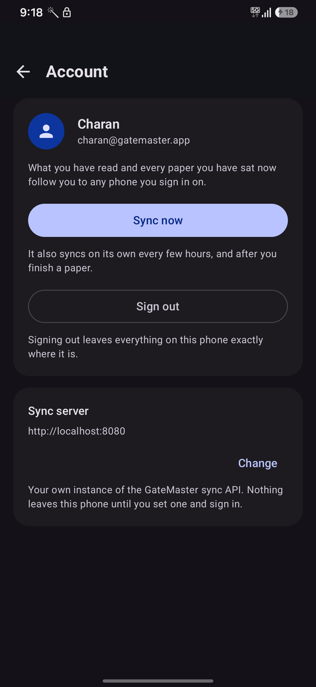
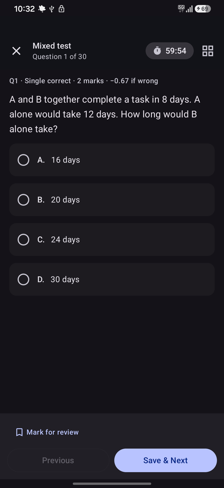
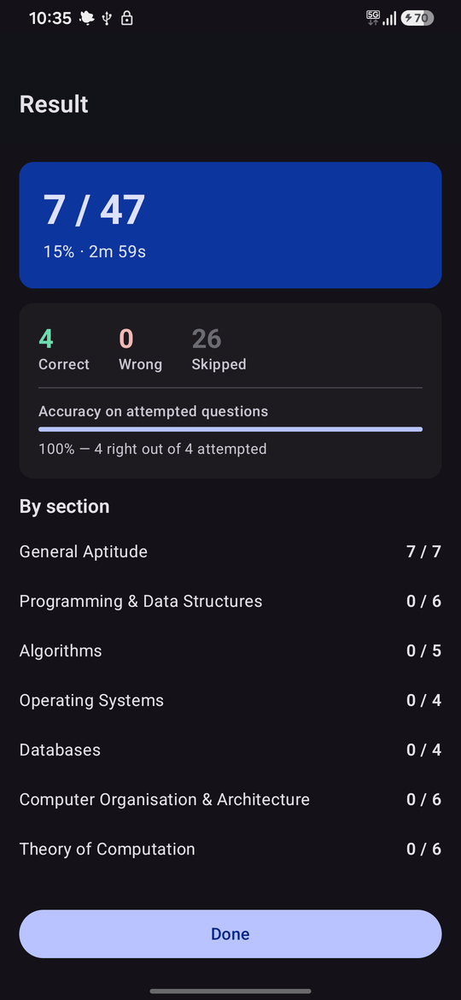
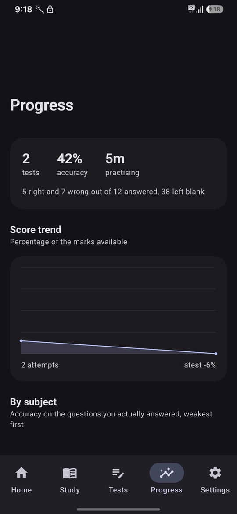
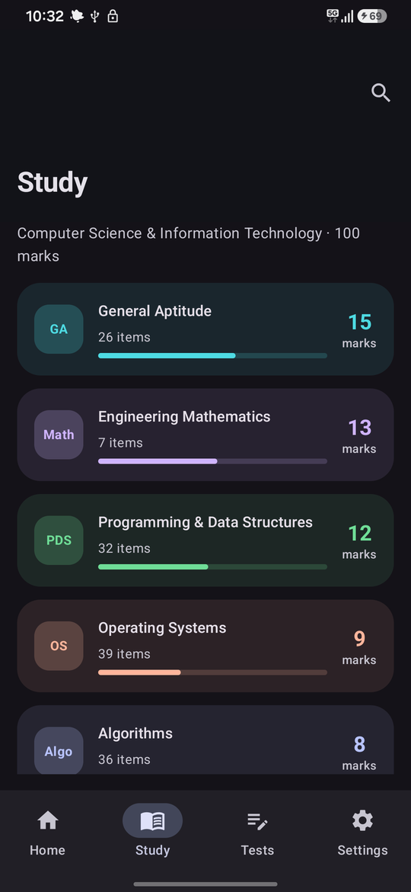
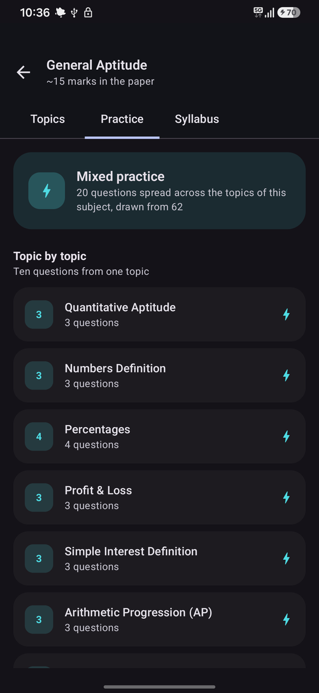
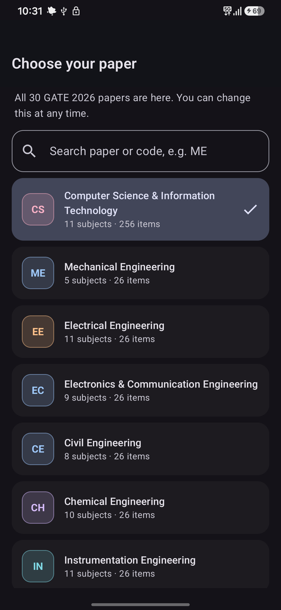
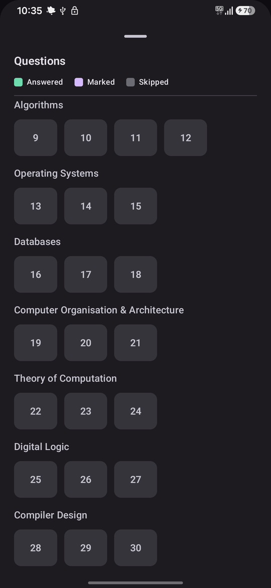

# GateMaster

[](https://github.com/charanteja2004/gatemaster/actions/workflows/ci.yml)

An Android study app for the GATE exam: bundled notes, previous-year papers, and
practice tests that score the way the real paper does -- plus an optional
account, so what you have read and every paper you have sat follow you to
another phone.

Kotlin, Jetpack Compose and Material 3 on the phone; Kotlin, Ktor and PostgreSQL
on the server; a shared module so the two cannot disagree about the wire format.
All 30 GATE 2026 papers are selectable. The pre-rewrite Java/XML app is preserved
at `legacy/` and is **not** part of the build.

## Install

Grab the APK from [Releases](https://github.com/charanteja2004/gatemaster/releases)
and open it on an Android phone (Android 7.0 or newer). Android will ask you to
allow installing from this source the first time.

Built from a plain checkout, that APK carries the notes, the practice question
bank and the syllabus. It does not carry the reference PDFs or previous-year
papers, which are not kept in the repository — see **Content pipeline** below.

| | | |
|:--:|:--:|:--:|
|  |  |  |
| **Home** — resume where you stopped | **Tests** — the set the app chose, first | **Account** — optional, and it says so |
|  |  |  |
| **Player** — the marking rule on every question | **Result** — scored subject by subject | **Progress** — which subjects cost marks |
|  |  |  |
| **Study** — subjects by paper weightage | **Practice** — a subject set, then topic by topic | **Papers** — previous years with answer keys |

## What it does

- **Notes for 11 CS subjects**, 217 topics, read in an in-app reader with its
  own stylesheet: syntax-highlighted code panels, callouts, formula plaques,
  scroll progress, adjustable text size, and previous/next topic navigation.
- **Practice tests assembled on demand** from a 410-question bank across nine
  subjects, at three sizes: ten questions for one topic, twenty for a subject,
  thirty for a mixed paper spanning several subjects. 71 topics hold enough
  questions to be offered a set of their own.
- **A fourth set the app chooses for you**, drawn from the topics your own
  attempt history says you get wrong and the ones you have not seen in a while,
  weighted by the marks each subject carries in the paper.
- **An optional account**, so what you have read and every paper you have sat
  follow you to another phone. Everything works signed out.
- **A mixed paper is scored subject by subject**, so it answers the question a
  single-subject test cannot: which subject is costing you marks.
- **GATE's actual marking scheme.** Three question types (MCQ, MSQ, NAT), a
  third of the marks deducted for a wrong MCQ and nothing else, no partial
  credit on MSQ, and NAT answers matched against the published tolerance range.
- **15 previous-year papers** with their answer keys, read in-app.
- **Progress that survives.** Continue-reading, per-subject read counts,
  bookmarks, and an in-progress attempt that outlives the process being killed.
- **Progress that answers the next question.** A scorecard says how one paper
  went; the Progress tab says which subjects are costing marks, which topics to
  go back to, and whether the score is moving — computed from every question of
  every attempt.
- **Search** across topic titles, ranked so a prefix match wins.
- **Light, dark or system theme** — applied to the notes as well as the app.

## Architecture

Three Gradle modules:

```
:app        the Android app
:server     the sync API — Ktor, no Android SDK anywhere in its build
:protocol   the wire contract, and nothing else
```

`:protocol` is a plain Kotlin module that both of the others depend on, so a
renamed field is a compile error on both sides at once rather than a 400 a user
discovers. It holds request and response types and no logic; anything
JVM-specific added to it would stop the app compiling, which is a better
guarantee than a comment asking people to be careful.

Inside `:app`, one direction of data flow:

```
ui/               Compose screens, one ViewModel each, state as StateFlow
core/data/        repositories — assets in, model out; no Android types leak up
core/data/auth/   tokens, the HTTP client, and who is signed in
core/data/sync/   the merge rule, the sync cycle, the background worker
core/data/db/     Room: attempt history and the analytics queries
core/model/       serializable model + the pure scoring functions
navigation/       type-safe routes
```

The repositories read through an `AssetSource` seam rather than `AssetManager`
directly, scoring is a pure function of (paper, attempt), and the session store
is an interface so the HTTP layer stays testable without the Android Keystore.
Between them, the whole of the app's logic is testable on the JVM — there is no
emulator in the loop.

---

## Requirements

| | |
|---|---|
| JDK | 17+ (Android Studio's bundled JBR 21 is what this is built with) |
| Android Studio | 2025.3.1 or newer (it must support AGP 9.0) |
| SDK platforms | 36 — Gradle installs it on first build |

From the command line:

```sh
export JAVA_HOME="C:/Program Files/Android/Android Studio/jbr"
./gradlew :app:assembleDebug
./gradlew :app:testDebugUnitTest
./gradlew :server:test          # needs no database and no Docker
```

To build an APK that points at a sync server:

```sh
./gradlew :app:assembleDebug -Pgatemaster.syncBaseUrl=https://your-host
```

It can also be set per install, in Settings → Account, which is what makes one
APK usable against a local server and a deployed one.

## Toolchain notes

These are the non-obvious constraints. Change them only deliberately.

- **AGP 9 has built-in Kotlin.** Applying `org.jetbrains.kotlin.android` is a
  hard error. The Compose and serialization compiler plugins are still applied
  normally, and KGP is pinned on the buildscript classpath in the root
  `build.gradle.kts` so it matches the version those plugins expect.
- **`jvmTarget` lives inside `android { kotlin { compilerOptions { … } } }`**,
  not a top-level `kotlin {}` block.
- **Kotlin is held at 2.3.x**, not 2.4, because KSP — which Room and Hilt both
  need — has no 2.4 release yet.
- **AGP is held at 9.0.0, and that holds AndroidX back with it.** 9.0.0 is the
  newest AGP that Android Studio 2025.3.1 will open a project with. Compose 1.12
  (BOM 2026.08.00), lifecycle 2.11 and material3-adaptive 1.3 all refuse to
  build under anything below AGP 9.1, so they are pinned one release back —
  BOM 2026.06.01, lifecycle 2.10.0, adaptive 1.2.0. Raising any of them means
  upgrading Android Studio first; the version catalog says so at each pin.
- **`compileSdk` and `targetSdk` are both 36.** 36 is the highest compile SDK
  AGP 9.0 supports, and it is what Google Play requires as a target.
- **`minSdk` is 24.** The old app used 31, which excluded every device on
  Android 11 or older for no technical reason.

## Releasing

`.github/workflows/release.yml` builds a signed APK and publishes it whenever a
version tag is pushed:

```sh
git tag v0.2.0
git push origin v0.2.0
```

The tag runs the tests first, so a tag that fails its own suite never becomes a
download.

### Signing

The keystore is never committed. Create one once:

```sh
keytool -genkeypair -v -keystore release.jks -alias gatemaster \
        -keyalg RSA -keysize 2048 -validity 10000
```

Keep it somewhere safe and back it up: Android identifies an app by its signing
key, so losing it means never being able to update this app again under the
same identity.

For local release builds, put a `keystore.properties` next to
`settings.gradle.kts` (it is git-ignored):

```properties
storeFile=release.jks
storePassword=…
keyAlias=gatemaster
keyPassword=…
```

Without that file the release build still compiles — it simply comes out
unsigned, so a fresh clone and CI are never blocked on a secret they do not
have.

For the workflow, add four repository secrets: `KEYSTORE_BASE64`
(`base64 -w0 release.jks`), `KEYSTORE_PASSWORD`, `KEY_ALIAS` and `KEY_PASSWORD`.
The job writes them to disk for the length of the build and deletes them
afterwards.

## Content pipeline

All study material lives in `app/src/main/assets/` and is described by a single
generated file, `assets/content_index.json`. Nothing about content is hardcoded
in Kotlin.

**PDFs are not in the repository.** `assets/pdfs/` and `assets/previousPapers/`
are git-ignored: they are large, and they are third-party documents. A plain
checkout therefore builds an APK with notes and practice but no handouts or
previous-year papers. `ContentRepository` prunes the index to whatever the build
actually carries, so the app offers what it can open rather than listing rows
that fail when tapped — and the content test checks a referenced PDF only when
its folder is present.

To add or change material: drop files into the right assets folder, then

```sh
python tools/build_content_index.py      # rebuild the index
python tools/normalize_content_html.py   # make new HTML phone-readable
python tools/fix_content.py              # mechanical defect fixes
python tools/enrich_content.py           # add the reader's semantic hooks
python tools/build_test_bank.py          # rebuild the mock-test question bank
./gradlew :app:testDebugUnitTest         # verify nothing is orphaned
```

### `tools/build_content_index.py`

Scans the assets folders and emits `content_index.json`: subjects, topics,
per-subject reference PDFs, short notes, and previous-year papers paired with
their answer keys. Topic titles come from each document's own heading rather
than its filename, with an override table for the handful that have no usable
heading.

Replaces the old `generate_json.ps1`, which globbed `*.html` only — which is
why Previous Papers shipped with zero topics and 22 MB of PDFs were unreachable.

### `tools/normalize_content_html.py`

Injects `<meta charset>`, `<meta name="viewport">`, and a link to the shared
`assets/reader.css` into every bundled article, so they render at phone width
and follow the system dark theme. Idempotent — safe to re-run. Pass `--check`
to report without writing.

`assets/reader.css` is loaded last so it overrides the per-file `<style>`
blocks by cascade order rather than by deleting anything.

### `tools/audit_content.py`

Finds the defects in the bundled notes that can be caught mechanically: links
that go nowhere, images that were never copied across, articles that stop
mid-sentence, placeholder text, duplicated bodies, and documents with no
heading. It does **not** verify that the physics is right — that needs a human
who knows the subject.

### `tools/fix_content.py`

Applies the fixes the audit surfaces. Every rewrite is from an explicit,
reviewed table rather than fuzzy matching at run time — a close-string match
would happily rewrite a link to Strassen's algorithm into a link to Dijkstra's.

### `tools/syllabus.py`

Branch, subject and syllabus data for all 30 GATE 2026 papers. Paper names and
codes are the official list from gate2026.iitg.ac.in. Eight papers (CS, ME, EE,
EC, CE, CH, IN, DA) carry a full subject breakdown with syllabus bullets and
mark weightage; the remaining 22 carry their section names, and the app says so
rather than pretending otherwise.

### `tools/enrich_content.py`

Adds the semantic structure `reader.css` styles. The source articles are
undifferentiated prose — a note, a worked example, a formula and a complexity
result all look identical, which is what makes them tiring to read on a phone.
This pass finds them by the conventions the authors already used and tags them:

- runs of SyntaxHighlighter `.line` divs become a single code panel
- `<table>` gets a scroll container so wide tables stop stretching the page
- `` becomes a `<figure>` with its alt text as a caption, marked when the
  source is remote
- lead-in paragraphs become callouts (Note, Example, Syntax, Solution,
  Definition, Time/Space Complexity, Step N)
- short relational lines become formula plaques

A bare "Example:" introducing a list becomes a compact section label rather than
a box, since framing a lone word just repeats it. The formula detector is
deliberately conservative: a paragraph wrongly promoted to a plaque looks worse
than one left as plain prose.

Idempotent and marker-guarded.

### `tools/build_test_bank.py`

Converts the legacy `assets/mock1.json` into `assets/tests/` — the GATE-shaped
schema with MCQ / MSQ / NAT, per-question marks and sections — and writes
`assets/tests/catalogue.json`. Questions that cannot be converted are reported
and skipped rather than shipped broken.

## Reading progress and bookmarks

`StudyProgressRepository` remembers what has been opened, how far it was read,
and what was saved. It backs the Continue-reading card on home, the read ticks
and "N of M read" counts in the subject lists, and the bookmark action in the
reader.

Two rules worth knowing:

- **Furthest-read only moves forward.** Scrolling back up does not un-read what
  has been read.
- **Reaching the last tenth counts as read**, and an article that fits on one
  screen counts as read once it is shown. Requiring a full scroll to 100% would
  leave every short topic permanently unread, because there is nothing to
  scroll to.

Stored as one JSON document in the app's files directory rather than Room: it is
small, read once at startup, and every screen wants all of it.

## Theme

Light, dark or match-system, chosen in Settings and stored in DataStore. The app
owns this rather than deferring to the phone, because reading is not the same as
using an app: plenty of people keep their phone in dark mode all day and still
want study notes on a light page.

The notes follow the same choice. `reader.css` carries the light palette and
`reader-dark.css` the dark one, and `ReaderCssHandler` assembles the stylesheet
at request time through `WebViewAssetLoader`. A `@media (prefers-color-scheme)`
block would have handed the decision back to the system — the exact bug this
replaced. Doing it in the loader also keeps JavaScript switched off and avoids
the flash of restyling a page after it has painted.

## Reading experience

`assets/reader.css` is the single stylesheet behind every article. It gives each
heading level its own visual anchor, puts code in a dark editor panel in both
themes (mapping the source's own syntax tokens to a legible palette), frames
diagrams so they stay visible against a dark background, and gives callouts,
formula plaques and complexity chips distinct, skimmable forms.

The reader itself adds a scroll-progress bar, a text-size control persisted in
DataStore, and previous/next topic navigation so studying is a sequence rather
than repeated trips back to a list.

**Known limitation:** the notes carry no diagrams. The scraped articles they
replaced hotlinked 722 images from an external CDN, which is exactly why they
were replaced; the notes are now entirely self-contained text and render
identically offline. Eight hand-drawn SVGs sit unused in `tools/diagrams/` --
wiring them back into the topics they illustrate is the obvious next content
pass.

## Practice

A three-hour mock is the wrong shape for a phone, and one subject at a time is
the wrong shape for finding out what you are weak at. `assets/questions/<subject>.json`
holds questions tagged with the topic they belong to, and `TestRepository`
assembles a paper on demand in one of three sizes:

| Mode | Size | Where it lives |
|---|---|---|
| **Recommended** | 15 questions the app chose | Tests tab, leading — see [What to practise next](#what-to-practise-next) |
| **Topic practice** | 10 questions from one topic | Practice tab inside a subject, and the bolt on a topic row |
| **Subject practice** | 20 questions across one subject | Practice tab, and the Tests tab |
| **Mixed test** | 30 questions across several subjects | Tests tab — everything, or a chosen few |

Three rules run through all of them:

- **Questions are shuffled**, so a second attempt is not the same paper in the
  same order.
- **The draw is balanced** across whatever the set spans — topics within a
  subject, subjects within a mix. Without this a subject test becomes twenty
  questions about whichever topic happens to have the most written for it.
- **Duration is two minutes a question**, floored at 5 and capped at 60, which
  is roughly the GATE pace.

<p align="center">
  
</p>

A mixed paper gets **one section per subject**, so the scorecard reports a score
per subject, and the question palette groups by subject while the paper is being
sat. That is the whole point of it: a single-subject test can tell you
how well you know that subject, but only a mixed one tells you where tomorrow
should go.

A topic is offered its own set once it holds at least 3 questions — below that
the set would be the same three questions every time. Topics under the
threshold still feed the subject and mixed papers.

The generated test's id encodes what to build (`practice:topic:<subject>:<topic>`,
`practice:subject:<subject>`, `practice:mixed:<a>+<b>` or `practice:mixed:all`),
so it reaches the player through exactly the same route as a bundled test — no
second player and no second ViewModel. Ids written by earlier versions are still
read, so an attempt saved before the scheme changed still resumes.

The bank holds 410 questions across General Aptitude, Programming & Data
Structures, Algorithms, Operating Systems, Databases, Computer Organisation,
Theory of Computation, Digital Logic and Compiler Design. General Aptitude is
worth 15 marks in **every** GATE paper, so its bank is the one every candidate
can use whatever their branch.

The generated test's id encodes what to build (`quick:<subject>:<topic>`), so it
reaches the player through exactly the same route as a bundled test — no second
player and no second ViewModel.

## The test engine

`core/model/TestModels.kt` and `core/model/Attempt.kt` model the real paper:

- **Three question types.** MCQ (single correct), MSQ (one or more, no partial
  credit), NAT (typed number, matched against the published tolerance range).
- **GATE marking.** A wrong MCQ costs a third of its marks; MSQ and NAT carry
  no penalty; unattempted always scores zero.
- **A question palette** with answered / marked / skipped states, a countdown
  that pauses when the screen is not visible, mark-for-review, clear response,
  and free navigation in both directions.
- **A scorecard** with per-section totals, accuracy on attempted questions,
  marks lost to negative marking, and a per-question review showing the chosen
  and correct options.

Scoring is a pure function of the attempt plus the paper (`scoreAttempt`), so
the rules are unit-tested without a device.

An in-progress attempt is persisted as JSON in the app's files directory, so it
survives the process being killed. Finished attempts go to Room instead: one row
per attempt and one per question, which is what the Progress tab aggregates.

## What to practise next

Every other part of the app answers "how did that paper go". This answers the
question a scorecard cannot: **what should I do tomorrow**. The Tests tab leads
with a fifteen-question set the app chose, and it is the only place GateMaster
makes a recommendation — so `core/model/AdaptivePlan.kt` is written to be read,
and is a pure function of its inputs so the whole thing is tested on the JVM
with no database, no clock and no device.

It needs nothing new recorded. The per-question attempt history has been in Room
since the Progress tab was built; it was simply never read back.

Three things multiply into a topic's priority:

- **Weakness.** One minus mastery, where mastery is accuracy **smoothed with a
  prior** rather than `correct / attempted`. Raw accuracy calls one lucky answer
  100% and drops the topic for three weeks; it calls one unlucky answer a
  catastrophe. Starting each topic as though it had already been seen three
  times with one right means a single answer nudges the estimate and ten answers
  move it.
- **Dueness.** How long it has been, against an interval that grows with mastery
  — the spaced-repetition idea. A topic known cold waits three weeks; one barely
  known comes back tomorrow. Capped, because a topic last seen a year ago is not
  a hundred times more urgent than one from last week, and without the cap a
  single ancient topic takes every set forever.
- **Exam weight.** A 15-mark subject earns more practice than a 3-mark one.
  Half the weight is flat, so a light subject is practised less and never not at
  all. This is the part a general-purpose flashcard scheduler cannot do, and the
  reason to write one for this app rather than import one.

The questions are then **split across the top six topics** proportionally rather
than dumped on the single worst one — fifteen questions on one topic is a worse
revision session and a more boring one. Every chosen topic gets at least one,
the allocation always totals exactly what was asked for, and a topic whose bank
cannot fill its share hands the remainder back to the next priority down.

Topics never practised enter the rotation, but rank below a measured weakness:
unknown is not the same as known-to-be-bad, and treating it as such would bury
every real gap under everything the user has yet to touch.

## Accounts and sync

Optional, and the app is built so that it stays optional. Signed out it behaves
exactly as it did before there was a server: notes, practice, scoring and
progress all work with no network and no account. Signing in adds one thing --
your reading and your attempt history follow you to another phone.

The API is a second Gradle module, `:server` — Ktor and PostgreSQL. Its own
[README](server/README.md) covers the endpoints, the deployment and the schema.
Two decisions are worth reading either way.

### Refresh tokens rotate, and reuse is treated as theft

Access tokens are JWTs and cannot be revoked, so they live fifteen minutes.
Refresh tokens are opaque, revocable, and live two months; only their SHA-256
reaches the database.

Every refresh rotates the token, which makes each one single-use — so a token
presented twice means two parties hold it. The server cannot tell which of them
is the real user, so neither keeps the session: every token descended from that
sign-in is revoked, and the real user signs back in with a password the thief
does not have. Separate sign-ins are separate families, so this never signs out
the other device.

On the phone the session is encrypted with a key from the Android Keystore, so
it cannot be read out of a backup or an `adb run-as` dump of the data directory.

### The two synced shapes get different mechanisms

Because they are different kinds of data, and one mechanism for both would break
one of them.

**Reading progress is mutable shared state.** What you have read changes on
whichever phone you are reading on, so two devices genuinely can disagree.
Last-write-wins would let a phone that synced an hour late erase a week of
reading on the tablet. So the server row carries a revision, a write says which
revision it was based on, and a stale write is rejected with `409` — carrying
the current document, because the client needs it to merge and has just proved
it does not have it.

The merge itself is a pure function, `core/data/sync/mergeProgress`, and it is
where the real decisions are:

- `furthest` takes the **maximum**, because reading is cumulative — taking the
  later write would un-read half a chapter because of which phone was picked up
  last.
- `bookmarked` follows the **more recently opened** record. It is the one field
  a user toggles both ways, so OR could never remove a bookmark and AND could
  never keep one.

It is tested for idempotence and for commutativity, because sync runs on a
schedule: a merge that kept changing its answer would push a new revision every
six hours forever, and two devices that disagreed on the result would push
conflicting documents at each other indefinitely.

**Attempts are immutable historical facts.** A finished paper never changes, so
there is nothing to disagree about and no conflict resolution to write. Upload
is append-only and idempotent on a client-generated id — which is what stops the
retry after a dropped response counting the same sitting twice and skewing every
average built on it. Download is a cursor over a server-assigned sequence.

Sync runs in a `SyncWorker` on WorkManager rather than a coroutine tied to a
screen, for the case that actually happens: you finish a mock test on the train,
lock the phone, and the process is killed before the upload lands. It also runs
right after a paper is submitted, and on demand from the account screen.

## Tests

**192 JVM tests** — 158 for the app, 34 for the server. No emulator, no
database, no Docker.

```sh
./gradlew :app:testDebugUnitTest :server:test
```

- **`ScoringTest`** — the marking scheme, which is specific and easy to get
  subtly wrong: only single-answer MCQs are penalised, the penalty is a third of
  the question's marks, MSQ gives no partial credit, and a sparse answer map
  still grades every question.
- **`ContentIndexTest`** — the material that actually ships. Every referenced
  asset exists on disk, ids are unique, no HTML article is orphaned, titles are
  presentable, papers are ordered. Content drift breaks the build rather than
  the app.
- **`TestRepositoryTest`** — practice assembly for all three modes: the caps,
  the two-minute pace, the three-question threshold, the balanced draw, and a
  mixed paper getting one section per subject. Plus attempt persistence,
  including a half-written attempt file being discarded instead of failing
  every launch.
- **`PracticeSpecTest`** — the test id, which is the only thing crossing into
  the player and the key a saved attempt is filed under. It has to survive a
  round trip exactly and to keep reading ids written by older versions.
- **`StudyProgressRepositoryTest`** — furthest-read only moving forward, the
  last-tenth read rule, and progress surviving a restart. The clock is injected,
  so ordering is exact rather than dependent on machine speed.
- **`ContentRepositoryTest`** — search ranking and the failure paths the real
  assets deliberately never exercise: a malformed index surfaces as a failure
  rather than a silently empty app.
- **`AttemptDaoTest`** — the analytics SQL, under Robolectric so it stays on the
  JVM. An ORDER BY the wrong way round or a forgotten HAVING would produce a
  plausible screen full of wrong advice, which no other test would catch.
- **`AdaptivePlanTest`** — the scheduler's arithmetic, which is the only place
  the app makes a recommendation: that one lucky answer is not mastery, that a
  well-known topic still resurfaces once it is stale, that a heavier subject
  wins a tie, and that a proportional split of fifteen questions always totals
  fifteen.
- **`AdaptivePracticeTest`** — the plan meeting a real question bank: a topic
  with fewer questions than it was allocated hands the remainder to the next
  priority instead of shortening the paper, and no question is drawn twice.
- **`ProgressMergeTest`** — the sync merge rule, including the two properties
  that keep sync from oscillating: merging is idempotent, and it gives the same
  answer whichever device runs it.
- **`SyncApiTest`** — the HTTP layer against a mock engine. Which requests carry
  a token, that a 401 on `/auth/login` is a wrong password rather than an
  expired session, and that an unreachable server keeps the session while a
  refused refresh drops it.
- **`SyncManagerTest`** — a whole sync cycle against a real database and a
  scripted server: an upload is not repeated, the download cursor advances past
  the rows this device sent, and a rejected progress write merges and retries
  rather than losing a week of reading.

The server's suite is described in [server/README.md](server/README.md); it runs
on H2 locally and against real PostgreSQL in CI, so the schema's portability is
a fact rather than a claim.

CI runs the tests, Android lint and a debug build on every push
(`.github/workflows/ci.yml`), and publishes the APK as a build artifact.

## Project layout

```
protocol/                the wire contract, shared by the app and the server
app/                     the Kotlin + Compose app
  src/main/assets/       study material + generated content_index.json
  src/main/java/com/gatemaster/app/
    core/model/          serializable content model + pure scoring
    core/data/           repositories: assets in, model out
    core/data/auth/      Keystore-backed session, HTTP client, auth state
    core/data/sync/      the merge rule, the sync cycle, the worker
    core/data/db/        Room: attempt history and the analytics queries
    navigation/          type-safe routes
    ui/                  theme, screens, reader, progress, account
  schemas/               exported Room schemas, checked in for review
server/                  the sync API: Ktor, PostgreSQL, Docker
  src/main/resources/db/migration/   versioned SQL
tools/                   content pipeline and the authored notes
legacy/                  pre-rewrite Java/XML app, excluded from the build
```

## Branches

All 30 GATE 2026 papers are selectable. The paper is chosen on first launch and
switchable from the chip in the top bar.

General Aptitude is 15 marks in **every** paper, so its 26 articles are shared
across all 30 branches — every paper has real content from day one. Beyond that,
CS has the full note set; the other papers currently offer their official
syllabus, which is what candidates look up most often anyway.

## Deliberate choices

Things a reviewer might expect to find here and will not, with the reasoning:

- **A hand-rolled `AppContainer` rather than Hilt.** Nine ViewModels and four
  singletons do not need a DI graph, and the container keeps the build free of
  annotation processing. `AppViewModelProvider` is the only file that changes
  when that stops being true.
- **Two stores, on purpose.** Study progress is one small document, read once
  at startup and wanted whole by every screen, so it stays a JSON file. Attempt
  history is the opposite — it grows without bound and every question asked of
  it is an aggregate — so it lives in Room, one row per question, which is what
  makes the topic breakdown possible at all.
- **Content is generated, never hardcoded.** Everything the app shows comes from
  `content_index.json`, built by the scripts in `tools/`, so the content source
  is swappable without touching Kotlin.

## Not done yet

- A deployed instance of the sync API. The code, the image and the migrations
  are here; no public host runs them yet, so `SYNC_BASE_URL` is empty by
  default and the account screen says so
- Serving the study material from that backend instead of the APK
- Adaptive practice: the per-topic accuracy Room already stores is not yet fed
  back into which questions the next set draws
- Diagrams in the notes -- see the reading-experience limitation above
- A Play Store listing. The APK is published on GitHub Releases; Play needs a
  developer account and a review pass
- Notes for papers other than CS — the structure and syllabus are in place,
  the articles are not
- Detailed syllabus for the 22 outline papers
- Computer Networks and Discrete Mathematics have no notes in CS
- Question banks for Computer Networks and Engineering Mathematics — blocked
  on those two subjects having no topics in the index to tag questions against
- Depth in the older banks: Algorithms, Operating Systems, Databases and Data
  Structures each have around 50 questions but only four or five topics deep
  enough for a per-topic set

## License

The code is MIT. The study material -- the notes under `app/src/main/assets/`,
their definitions under `tools/notes/`, and the question banks -- was written
for this app and stays copyrighted; use it to study, not to republish. See
[LICENSE](LICENSE).
